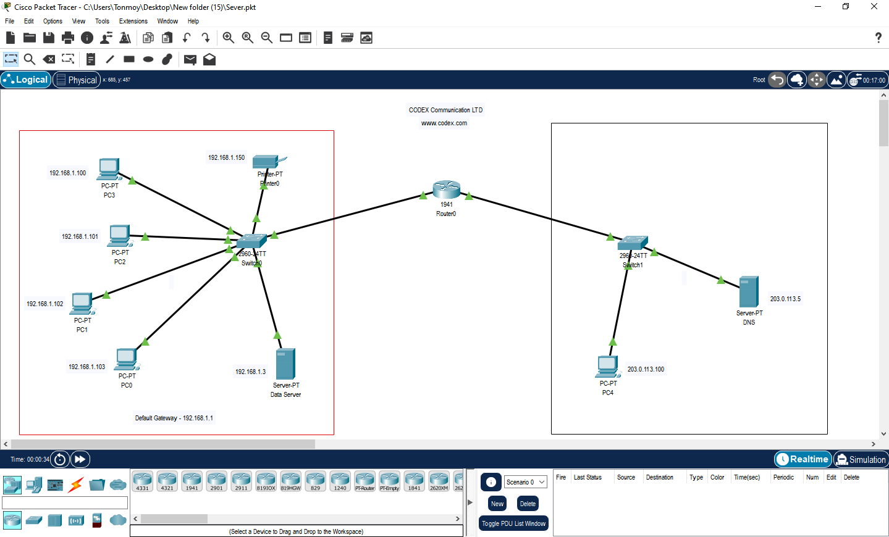
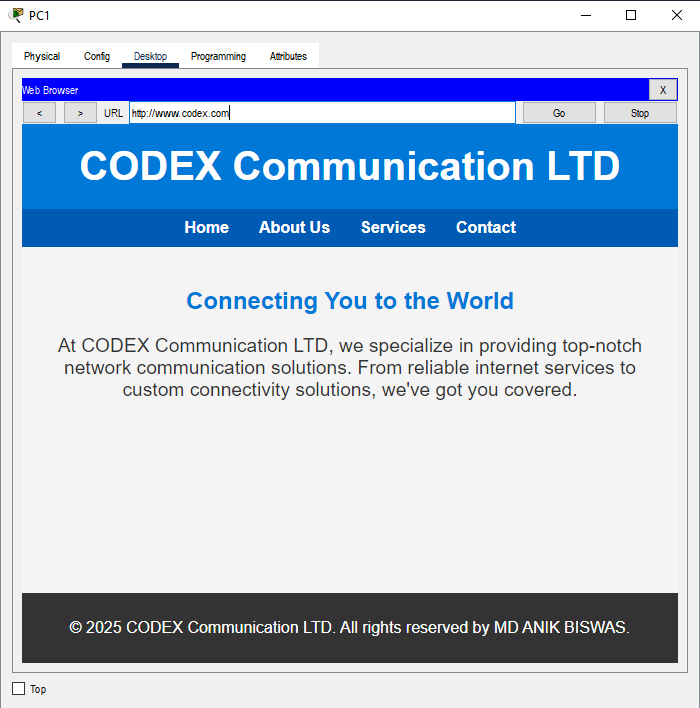

# CODEX Communication LTD - Network Simulation Project 🏠

This project, created in Cisco Packet Tracer, simulates a complete network for a fictional company, "CODEX Communication LTD." It demonstrates the configuration and interaction of essential network services, including DNS, DHCP, HTTP, and Email.

## Network Topology

The network is divided into two primary segments connected by a central router, representing a main office and a separate service branch.

- **Main Office (LAN):** Uses the `192.168.1.0/24` address space. This segment contains multiple client PCs, an Email server, and a Data server. A switch manages local traffic, and a router provides the default gateway (`192.168.1.1`).
- **Service Branch:** Uses the `203.0.113.0/24` address space. This segment hosts the authoritative DNS server for the `codex.com` domain and an additional client PC.

The overall architecture is depicted below:

## Configured Services ⚙️

The simulation is configured with the following key services:

- **DNS (Domain Name System):** The DNS server, located at `203.0.113.5`, resolves the domain `www.codex.com` to the web server's IP address.
- **HTTP (Hypertext Transfer Protocol):** A web server is configured to host the company's official website. Client PCs can browse and access this site using its domain name.
- **Email (SMTP/POP3):** An email server is set up on the main office LAN, allowing users within the network to exchange emails.
- **DHCP (Dynamic Host Configuration Protocol):** While not explicitly shown with a dedicated server icon, DHCP functionality is assumed to be configured on the router or a server to assign IP addresses to end-user PCs dynamically.

## Demonstration of Service

The DNS and HTTP services are fully functional. A client PC can successfully navigate to `http://www.codex.com`, which resolves to the correct IP and displays the company's webpage, as shown below.

## Requirements

- **Cisco Packet Tracer:** Version 8.0 or a compatible higher version is required to open and run the simulation.

## How to Use 💡

1.  Ensure you have a compatible version of Cisco Packet Tracer installed on your system.
2.  Download the project file: `Office Network Simulation.pkt`.
3.  Open `Office Network Simulation.pkt` using Cisco Packet Tracer.
4.  The simulation will load in "Realtime" mode. You can switch to "Simulation" mode to observe packet flow step-by-step.
5.  To test the services, you can:
    -   Open a web browser from any client PC and navigate to `http://www.codex.com`.
    -   Use the `ping` command from the command prompt of a PC to test connectivity between devices (e.g., `ping 203.0.113.5`).
    -   Configure the email client on a PC to send and receive messages.

---

## License 📜
This project has no license.

## Important Links 🔗
- **Repository Link:** [https://github.com/tonmoylive/server](https://github.com/tonmoylive/Network-Server)

## Fork it 🍴
If you find this project helpful, consider forking it to explore and implement your own improvements.
Also, feel free to contribute, suggest improvements, report bugs, request features.

<footer>
  
© 2025 <a href="https://github.com/tonmoylive/Network-Server">Office Network Simulation</a> by <a href="https://mdanikbiswas.rf.gd/">MD ANIK BISWAS</a>

  
 Feel free to contribute ,report bugs , request features, like and give a star ⭐ to this repository. 

</footer>
